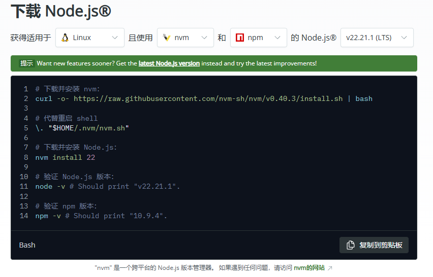
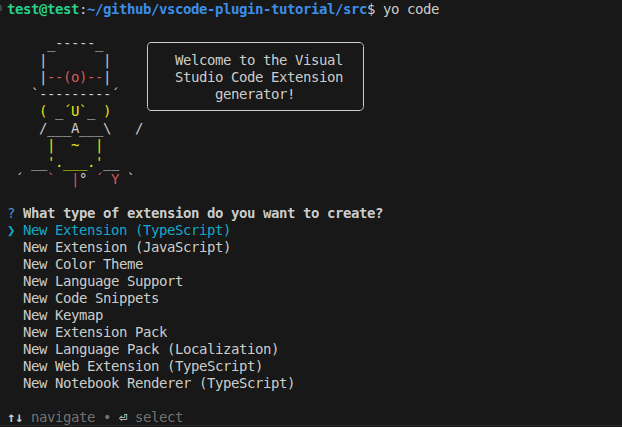
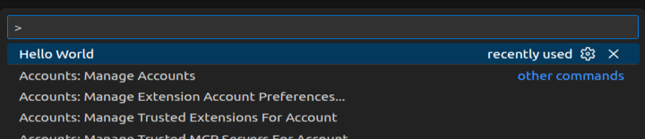
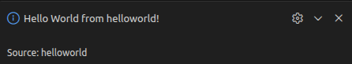

# VSCode 插件开发

参考文献：<https://liiked.github.io/VS-Code-Extension-Doc-ZH/>

官网案例：<https://github.com/microsoft/vscode-extension-samples>


## 一、环境配置

运行环境：
- 操作系统：ubuntu22.04.1
- vscode： 1.107.1， 当前版本vscode推荐的Nodejs为22.21.1，因此下载Node.js对应的版本
- Node.js：22.21.1
- npm: 10.9.4

```bash
apt install -y node-typescript
```

### 1.1 下载Node.js

网址：<https://nodejs.org/zh-cn/download>

离线安装包：<https://nodejs.org/dist/v22.21.1/node-v22.21.1-linux-x64.tar.xz>


Node.js会自带 `node` 和 `npm` 命令。




具体的命令行如下：

```bash
# 下载并安装 nvm：
curl -o- https://raw.githubusercontent.com/nvm-sh/nvm/v0.40.3/install.sh | bashju

# 代替重启 shell
\. "$HOME/.nvm/nvm.sh"

# 下载并安装 Node.js：
nvm install 22

# 验证 Node.js 版本：
node -v # Should print "v22.21.1".

# 验证 npm 版本：
npm -v # Should print "10.9.4".
```

### 1.2 安装Yeoman和VS code扩展生成器

使用npm安装Yeoman和VS Code扩展生成器

```bash
npm install -g yo generator-code
```

运行截图如下：


也可以下载离线包

<https://registry.npmmirror.com/generator-code/-/generator-code-1.11.15.tgz>

<https://registry.npmmirror.com/yo/-/yo-6.0.0.tgz>


## 二、创建一个项目

在vscode中打开一个空的文件夹，在终端中输入 yo code，然后逐步填入这些值。此时该目录中出现了一个名为 `helloworld` 的文件夹。



描述下这个图片的选项，这里选择TypeScript，使用TypeScript语言制作新vscode扩展插件。


```bash
New Extension (TypeScript) # 使用TypeScript语言制作新vscode扩展插件
New Extension (JavaScript) # 使用JavaScript语言制作新vscode扩展插件
New Color Theme # 创建新的颜色主题可供 VS Code 使用。
New Language Support # 添加对新编程语言的支持，包括语法高亮、代码提示等
New Code Snippets # 创建自定义代码段（snippets），提高编写代码的效率
New Keymap # 创建新的键位映射，以便用户可以使用自定义的快捷键
New Extension Pack # 创建一个包含多个扩展的包，可以一起安装
New Language Pack (Localization) # 创建新的语言包，使 VS Code 支持多种语言界面
New Web Extension (TypeScript) # 创建针对 Web 的 VS Code 扩展，使用 TypeScript
New Notebook Renderer (TypeScript) # 创建新的 Notebook 渲染器，用于展示不同类型的内容
```


在选择使用TypeScript语言制作VScode扩展插件后，逐个填入以下内容, 具体如下：


``` bash
✔ What type of extension do you want to create? New Extension (TypeScript)
✔ What's the name of your extension? 这个是扩展组件的名称
### 按<Enter>键选择所有选项的默认值 ###
✔ What's the identifier of your extension? 这个是扩展代码使用的名称
✔ What's the description of your extension? 这个是扩展描述
✔ Initialize a git repository? 是否初始化git仓库？填入否
✔ Which bundler to use? unbundled 是否使用webpack打包源代码？ 填入unbundled
✔ Which package manager to use? 你想使用哪个包管理器？ 填入npm
```


目录结构

```bash
.
├── .vscode
│   ├── launch.json     // 插件加载和调试的配置
│   └── tasks.json      // 配置TypeScript编译任务
├── .gitignore          // 忽略构建输出和node_modules文件
├── README.md           // 一个友好的插件文档
├── src
│   └── extension.ts    // 插件源代码
├── package.json        // 插件配置清单
├── tsconfig.json       // TypeScript配置
```


此时的extension.ts文件如下：

```bash
// The module 'vscode' contains the VS Code extensibility API
// Import the module and reference it with the alias vscode in your code below
import * as vscode from 'vscode';

// This method is called when your extension is activated
// Your extension is activated the very first time the command is executed
export function activate(context: vscode.ExtensionContext) {

	// Use the console to output diagnostic information (console.log) and errors (console.error)
	// This line of code will only be executed once when your extension is activated
	console.log('Congratulations, your extension "helloworld" is now active!');

	// The command has been defined in the package.json file
	// Now provide the implementation of the command with registerCommand
	// The commandId parameter must match the command field in package.json
	const disposable = vscode.commands.registerCommand('helloworld.helloWorld', () => {
		// The code you place here will be executed every time your command is executed
		// Display a message box to the user
		vscode.window.showInformationMessage('Hello World from helloworld!');
	});

	context.subscriptions.push(disposable);
}

// This method is called when your extension is deactivated
export function deactivate() {}


```

点击F5，会弹出一个vscode弹窗，然后，ctrl+shift+p 输入Hello World ， 点击运行

这里，如果进行修改的话，也可以直接使用命令 npm run compile 来检测代码是否正常。



vscode右下角会出现下面操作

